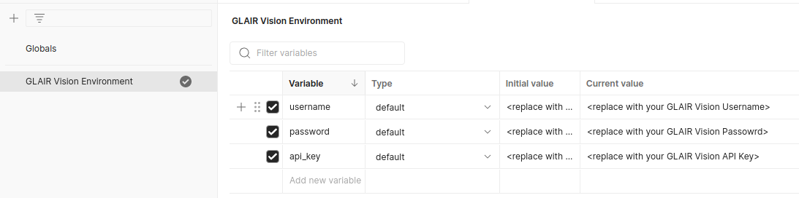
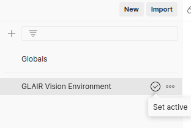
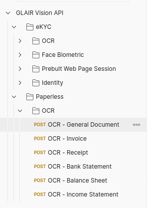
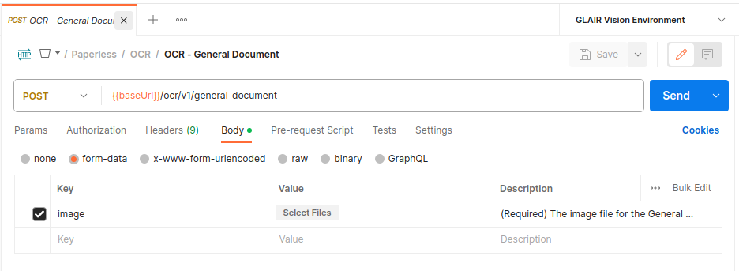

# GLAIR Vision API Postman Collection

This is a Postman collection covering the GLAIR Vision API. Please refer to [https://docs.glair.ai](https://docs.glair.ai) for more details.

## Requirements

- [Postman](https://www.getpostman.com/downloads/)
- [Glair Vision Account](mailto:hi@glair.ai)

## Getting Started

1. Download and install Postman from [here](https://www.postman.com/downloads/).
2. Once successfully installed, import both the [GlairVisionAPICollection.json](https://github.com/glair-ai-shadow/glair-vision-postman/blob/main/GLAIRVisionAPICollection.json) and [GlairVisionEnvironment.json](https://github.com/glair-ai-shadow/glair-vision-postman/blob/main/GLAIRVisionEnvironment.json) into your Postman workspace.
3. Set your GLAIR Vision Account `username`, `password`, and `api_key` in the [environment variables](https://learning.postman.com/docs/sending-requests/variables/). Make sure to save the changes.
   
   

4. Select the environment variable as active in the workspace.
   
   

5. You should now be ready to make requests. You can test sending a request by choosing one of the requests in the Collections.

   
   
   Add the required **parameters** and click send.

   

   If the request is successful, you should see the response in the **body** section and receive a status code **200 OK**.
